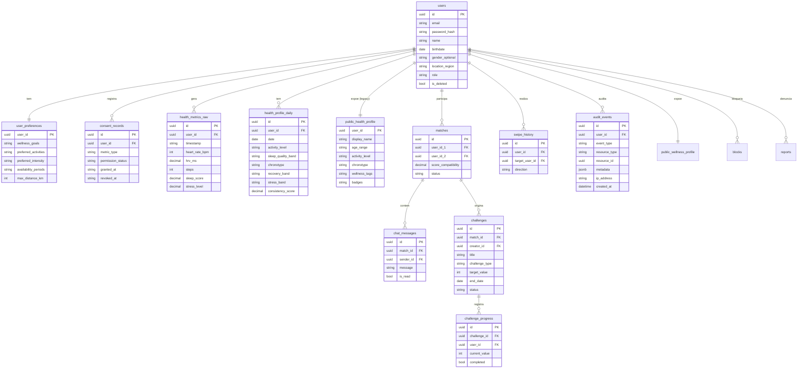

# Data Model — WellMatch

> Documento vivo do modelo de dados. Atualizado sempre que uma entidade for criada, alterada ou removida.
> **Ultima atualizacao:** 2026-07-04 (v0.4.0)

---

## Indice

- [Visao Geral](#visao-geral)
- [Diagrama ER](#diagrama-er)
- [Entidades: wellmatch](#entidades-wellmatch)
- [Entidades: Surak](#entidades-surak)
- [Enums e Dominio de Valores](#enums-e-dominio-de-valores)
- [Indices e Performance](#indices-e-performance)
- [Classificacao de Privacidade](#classificacao-de-privacidade)
- [Decisoes de Modelagem](#decisoes-de-modelagem)

---

## Visao Geral

O modelo e dividido em dois servicos com bancos independentes. O banco principal (PostgreSQL + TimescaleDB) pertence ao backend wellmatch e armazena usuarios, preferencias, perfis derivados, matches e chat. O microsservico Surak (Java/Spring) e stateless — processa e devolve resultados, sem persistencia propria.

**Banco principal:** PostgreSQL 15 + TimescaleDB
**ORM:** TypeORM (NestJS)
**Extensoes:** uuid-ossp, pgcrypto, timescaledb
**Surak:** stateless, sem banco proprio

---

## Diagrama ER

---

## Entidades: wellmatch

---

### users

> Cadastro central do usuario. Campos de identificacao direta ficam aqui e nunca saem via API publica.

**Tabela:** `users`
**Servico:** backend/modules/users

| Campo | Tipo SQL | Nullable | Default | Descricao |
|-------|----------|----------|---------|-----------|
| `id` | UUID | Nao | uuid_generate_v4() | Identificador unico |
| `email` | VARCHAR(255) | Nao | — | Email unico de cadastro |
| `password_hash` | VARCHAR(255) | Nao | — | Hash bcrypt da senha |
| `name` | VARCHAR(255) | Nao | — | Nome de exibicao |
| `birthdate` | DATE | Sim | NULL | Data de nascimento |
| `gender_optional` | VARCHAR(50) | Sim | NULL | Genero autodeclarado (opcional) |
| `bio` | TEXT | Sim | NULL | Descricao livre do usuario |
| `location_region` | VARCHAR(255) | Sim | NULL | Regiao textual aproximada |
| `avatar_url` | VARCHAR(500) | Sim | NULL | URL da foto de perfil |
| `latitude` | DECIMAL(10,7) | Sim | NULL | Coordenada geografica (latitude) |
| `longitude` | DECIMAL(10,7) | Sim | NULL | Coordenada geografica (longitude) |
| `role` | VARCHAR(20) | Nao | 'user' | user / moderator / admin |
| `is_deleted` | BOOLEAN | Nao | FALSE | Soft delete LGPD |
| `deleted_at` | TIMESTAMPTZ | Sim | NULL | Data da exclusao logica |
| `created_at` | TIMESTAMPTZ | Nao | NOW() | Data de cadastro |
| `updated_at` | TIMESTAMPTZ | Nao | NOW() | Ultima atualizacao |

**Constraints:**
- `UNIQUE(email)`
- Index parcial em `email` WHERE `is_deleted = FALSE`

---

### user_preferences

> Preferencias declaradas pelo usuario no onboarding. Base dos criterios de compatibilidade.

**Tabela:** `user_preferences`
**Servico:** backend/modules/users

| Campo | Tipo SQL | Nullable | Default | Descricao |
|-------|----------|----------|---------|-----------|
| `user_id` | UUID PK | Nao | — | FK para users |
| `wellness_goals` | TEXT[] | Nao | '{}' | Objetivos: fitness, sleep, stress_reduction... |
| `preferred_activities` | TEXT[] | Nao | '{}' | Atividades: running, yoga, cycling... |
| `preferred_intensity` | VARCHAR(50) | Nao | 'moderate' | Ver enum Intensity |
| `availability_periods` | TEXT[] | Nao | '{}' | Periodos: morning, afternoon, evening, weekend |
| `max_distance_km` | INTEGER | Nao | 50 | Raio maximo para match geografico |
| `chronotype_preference` | VARCHAR(50) | Sim | NULL | Preferencia de cronotype do parceiro |
| `show_photos_after_match` | BOOLEAN | Nao | TRUE | Controle de privacidade de foto |

---

### consent_records

> Log auditavel de consentimento por metrica de saude. Exigido pela LGPD art. 11.
> Inclui purpose, consent_version e metadata para rastreabilidade expandida (v0.2.0).

**Tabela:** `consent_records`
**Servico:** backend/modules/health

| Campo | Tipo SQL | Nullable | Default | Descricao |
|-------|----------|----------|---------|-----------|
| `id` | UUID | Nao | uuid_generate_v4() | Identificador unico |
| `user_id` | UUID | Nao | — | FK para users |
| `metric_type` | VARCHAR(100) | Nao | — | Ver enum HealthMetricType |
| `permission_status` | VARCHAR(20) | Nao | — | granted / revoked / pending |
| `purpose` | VARCHAR(50) | Nao | 'matching_compatibility' | Finalidade do consentimento |
| `consent_version` | VARCHAR(10) | Nao | 'v1' | Versao da politica de consentimento |
| `granted_at` | TIMESTAMPTZ | Sim | NULL | Momento do consentimento |
| `revoked_at` | TIMESTAMPTZ | Sim | NULL | Momento da revogacao |
| `source_provider` | VARCHAR(100) | Sim | NULL | Origem: simulated, healthkit, health_connect, garmin, fitbit... |
| `metadata` | JSONB | Sim | NULL | Metadados adicionais |
| `created_at` | TIMESTAMPTZ | Nao | NOW() | Data do registro |
| `updated_at` | TIMESTAMPTZ | Nao | NOW() | Ultima atualizacao |

---

### health_metrics_raw

> Metricas brutas coletadas do dispositivo. Tabela TimescaleDB (hypertable por timestamp).
> **INTERNAL ONLY** — nunca exposta via API. Acesso restrito ao modulo de saude.

**Tabela:** `health_metrics_raw`
**Servico:** backend/modules/health
**Tipo:** Hypertable TimescaleDB (particao por `timestamp`)

| Campo | Tipo SQL | Nullable | Descricao |
|-------|----------|----------|-----------|
| `id` | UUID | Nao | Identificador |
| `user_id` | UUID | Nao | FK para users |
| `timestamp` | TIMESTAMPTZ | Nao | Momento da medicao (chave da hypertable) |
| `source_provider` | VARCHAR(100) | Sim | Origem do dado |
| `heart_rate_bpm` | INTEGER | Sim | Frequencia cardiaca (bpm) |
| `hrv_ms` | DECIMAL(6,2) | Sim | Variabilidade da FC (ms) |
| `steps` | INTEGER | Sim | Passos no periodo |
| `calories` | INTEGER | Sim | Calorias no periodo |
| `vo2max` | DECIMAL(5,2) | Sim | Consumo maximo de oxigenio |
| `sleep_minutes` | INTEGER | Sim | Duracao do sono (minutos) |
| `sleep_score` | DECIMAL(5,2) | Sim | Score de qualidade do sono (0-100) |
| `stress_level` | DECIMAL(5,2) | Sim | Nivel de estresse (0-100) |
| `blood_oxygen` | DECIMAL(5,2) | Sim | Oxigenacao sanguinea (%) |
| `skin_temp` | DECIMAL(5,2) | Sim | Temperatura cutanea (C) |

**Constraints:**
- `PRIMARY KEY (id, timestamp)` — exigido pelo TimescaleDB
- Row Level Security habilitado

---

### health_profile_daily

> Bandas derivadas das metricas brutas por dia. Dado seguro para uso interno.
> Nao expoe valores brutos — apenas categorias semanticas.

**Tabela:** `health_profile_daily`
**Servico:** backend/modules/health (HealthProfileProcessor)

| Campo | Tipo SQL | Nullable | Descricao |
|-------|----------|----------|-----------|
| `id` | UUID | Nao | Identificador |
| `user_id` | UUID | Nao | FK para users |
| `date` | DATE | Nao | Data de referencia |
| `activity_level` | VARCHAR(50) | Sim | sedentary / lightly_active / moderately_active / active / very_active |
| `avg_steps_band` | VARCHAR(50) | Sim | very_low / low / moderate / high / very_high |
| `sleep_quality_band` | VARCHAR(50) | Sim | poor / fair / good / great / excellent |
| `chronotype` | VARCHAR(50) | Sim | early_bird / morning / intermediate / afternoon / night_owl |
| `recovery_band` | VARCHAR(50) | Sim | low / fair / good / excellent |
| `stress_band` | VARCHAR(50) | Sim | low / moderate / high / very_high |
| `cardio_fitness_band` | VARCHAR(50) | Sim | below_average / average / above_average / excellent / superior |
| `consistency_score` | DECIMAL(5,2) | Sim | 0-100, baseado no coeficiente de variacao dos passos |
| `generated_at` | TIMESTAMPTZ | Nao | NOW() |

**Constraints:**
- `UNIQUE(user_id, date)`

---

### public_health_profile

> Perfil publico para exibicao no match. Unico dado de saude visivel para outros usuarios.
> Populado a partir de health_profile_daily (B001 — pipeline pendente).

**Tabela:** `public_health_profile`
**Servico:** backend/modules/matching

| Campo | Tipo SQL | Nullable | Descricao |
|-------|----------|----------|-----------|
| `user_id` | UUID PK | Nao | FK para users |
| `display_name` | VARCHAR(255) | Sim | Nome de exibicao anonimizado |
| `age_range` | VARCHAR(20) | Sim | Faixa etaria: "25-29", "30-34"... |
| `wellness_tags` | TEXT[] | Nao | '{}' | Tags derivadas dos objetivos e atividades |
| `badges` | TEXT[] | Nao | '{}' | Conquistas de consistencia |
| `activity_level` | VARCHAR(50) | Sim | Derivado de health_profile_daily |
| `chronotype` | VARCHAR(50) | Sim | Derivado de health_profile_daily |
| `goals` | TEXT[] | Nao | '{}' | Objetivos do usuario (de user_preferences) |
| `compatibility_summary` | TEXT | Sim | Texto gerado para exibicao no card |
| `updated_at` | TIMESTAMPTZ | Nao | NOW() |

---

### matches

> Registro de match bilateral entre dois usuarios.

**Tabela:** `matches`
**Servico:** backend/modules/matching

| Campo | Tipo SQL | Nullable | Descricao |
|-------|----------|----------|-----------|
| `id` | UUID | Nao | Identificador |
| `user_id_1` | UUID | Nao | FK para users (usuario de menor UUID por convencao) |
| `user_id_2` | UUID | Nao | FK para users |
| `score_compatibility` | DECIMAL(5,2) | Sim | Score calculado pelo CompatibilityCalculator (0-100) |
| `status` | VARCHAR(50) | Nao | active / unmatched / blocked |
| `created_at` | TIMESTAMPTZ | Nao | NOW() |

**Constraints:**
- `UNIQUE(user_id_1, user_id_2)`
- `CHECK (user_id_1 != user_id_2)`

---

### swipe_history

> Historico de likes e dislikes. Utilizado para rate limiting e deteccao de match bilateral.

**Tabela:** `swipe_history`
**Servico:** backend/modules/matching

| Campo | Tipo SQL | Nullable | Descricao |
|-------|----------|----------|-----------|
| `id` | UUID | Nao | Identificador |
| `user_id` | UUID | Nao | Quem swipou |
| `target_user_id` | UUID | Nao | Quem recebeu o swipe |
| `direction` | VARCHAR(10) | Nao | like / dislike / super_like |
| `timestamp` | TIMESTAMPTZ | Nao | NOW() |

**Constraints:**
- `UNIQUE(user_id, target_user_id)` — um swipe por par

---

### chat_messages

> Mensagens de chat entre usuarios com match ativo.
> Inclui read_at com timestamp preciso de leitura (v0.2.0).

**Tabela:** `chat_messages`
**Servico:** backend/modules/chat

| Campo | Tipo SQL | Nullable | Descricao |
|-------|----------|----------|-----------|
| `id` | UUID | Nao | Identificador |
| `match_id` | UUID | Nao | FK para matches |
| `sender_id` | UUID | Nao | FK para users |
| `message` | TEXT | Nao | Conteudo da mensagem |
| `is_read` | BOOLEAN | Nao | FALSE | Status de leitura |
| `read_at` | TIMESTAMPTZ | Sim | NULL | Timestamp de leitura |
| `timestamp` | TIMESTAMPTZ | Nao | NOW() |

---

### challenges

> Desafios de bem-estar criados entre dois usuarios com match ativo.

**Tabela:** `challenges`
**Servico:** backend/modules/challenges

| Campo | Tipo SQL | Nullable | Descricao |
|-------|----------|----------|-----------|
| `id` | UUID | Nao | Identificador |
| `match_id` | UUID | Nao | FK para matches |
| `creator_id` | UUID | Nao | FK para users |
| `title` | VARCHAR(255) | Nao | Titulo do desafio |
| `description` | TEXT | Sim | Descricao detalhada |
| `challenge_type` | VARCHAR(100) | Sim | steps / sleep_streak / weekly_activity / wellness_checkin |
| `target_value` | INTEGER | Sim | Meta numerica |
| `target_unit` | VARCHAR(50) | Sim | Unidade da meta |
| `start_date` | DATE | Sim | Inicio do desafio |
| `end_date` | DATE | Sim | Termino do desafio |
| `status` | VARCHAR(50) | Nao | 'active' | active / completed / cancelled |
| `created_at` | TIMESTAMPTZ | Nao | NOW() |

---

### public_wellness_profile

> Perfil seguro para matching baseado em bandas semanticas (v0.2.0).
> Substitui public_health_profile como fonte principal de dados de matching.
> Nao armazena dados brutos de saude — apenas preferencias declaradas e bandas derivadas.

**Tabela:** `public_wellness_profile`
**Servico:** backend/modules/matching

| Campo | Tipo SQL | Nullable | Default | Descricao |
|-------|----------|----------|---------|-----------|
| `user_id` | UUID PK | Nao | — | FK para users |
| `activity_level` | VARCHAR(20) | Sim | NULL | low / moderate / active / very_active |
| `activity_consistency_band` | VARCHAR(10) | Sim | NULL | low / medium / high |
| `sleep_routine_band` | VARCHAR(15) | Sim | NULL | irregular / regular / consistent |
| `chronotype_band` | VARCHAR(10) | Sim | NULL | early / morning / flexible / evening / night |
| `intensity_preference` | VARCHAR(10) | Sim | NULL | low / moderate / high / flexible |
| `main_intention` | VARCHAR(50) | Sim | NULL | Intencao principal declarada no onboarding |
| `preferred_activities` | TEXT[] | Nao | '{}' | Atividades preferidas (onboarding step 3) |
| `wellness_goals` | TEXT[] | Nao | '{}' | Objetivos de bem-estar (onboarding step 2) |
| `availability_periods` | TEXT[] | Nao | '{}' | Periodos de disponibilidade (onboarding step 4) |
| `public_badges` | TEXT[] | Nao | '{}' | Badges de conquistas |
| `score_confidence` | VARCHAR(10) | Nao | 'low' | Confianca do score: low / medium / high |
| `source` | VARCHAR(20) | Nao | 'manual' | Origem: manual / health_connect / healthkit / garmin / fitbit / mixed |
| `is_visible` | BOOLEAN | Nao | true | Visibilidade para outros usuarios |
| `onboarding_completed` | BOOLEAN | Nao | false | Onboarding multi-step concluido |
| `created_at` | TIMESTAMPTZ | Nao | NOW() | Data de criacao |
| `updated_at` | TIMESTAMPTZ | Nao | NOW() | Ultima atualizacao |

**Indices:**
- `idx_public_wellness_profile_visible` ON is_visible WHERE is_visible = true
- `idx_public_wellness_profile_onboarding` ON onboarding_completed WHERE onboarding_completed = true

---

### blocks

> Bloqueio de usuario. Quando ativo, matches sao marcados como 'blocked'.

**Tabela:** `blocks`
**Servico:** backend/modules/moderation

| Campo | Tipo SQL | Nullable | Default | Descricao |
|-------|----------|----------|---------|-----------|
| `id` | UUID | Nao | gen_random_uuid() | Identificador |
| `blocker_id` | UUID | Nao | — | FK para users (quem bloqueou) |
| `blocked_id` | UUID | Nao | — | FK para users (quem foi bloqueado) |
| `reason` | TEXT | Sim | NULL | Motivo do bloqueio |
| `created_at` | TIMESTAMPTZ | Nao | NOW() | Data |

**Constraints:** UNIQUE(blocker_id, blocked_id)

---

### reports

> Denuncia de usuario para moderacao.

**Tabela:** `reports`
**Servico:** backend/modules/moderation

| Campo | Tipo SQL | Nullable | Default | Descricao |
|-------|----------|----------|---------|-----------|
| `id` | UUID | Nao | gen_random_uuid() | Identificador |
| `reporter_id` | UUID | Nao | — | FK para users (quem denunciou) |
| `reported_id` | UUID | Nao | — | FK para users (quem foi denunciado) |
| `reason` | VARCHAR(50) | Nao | — | inappropriate_content / harassment / fake_profile / underage / spam / offline_behavior / other |
| `description` | TEXT | Sim | NULL | Descricao detalhada |
| `match_id` | UUID | Sim | NULL | FK para matches (opcional) |
| `status` | VARCHAR(20) | Nao | 'pending' | pending / reviewed / dismissed / action_taken |
| `created_at` | TIMESTAMPTZ | Nao | NOW() | Data |

---

### moderation_actions

> Acao tomada pela moderacao contra um usuario.

**Tabela:** `moderation_actions`
**Servico:** backend/modules/moderation

| Campo | Tipo SQL | Nullable | Default | Descricao |
|-------|----------|----------|---------|-----------|
| `id` | UUID | Nao | gen_random_uuid() | Identificador |
| `target_user_id` | UUID | Nao | — | FK para users |
| `action_type` | VARCHAR(30) | Nao | — | warning / temporary_ban / permanent_ban / content_removed |
| `reason` | TEXT | Sim | NULL | Justificativa |
| `report_id` | UUID | Sim | NULL | FK para reports |
| `expires_at` | TIMESTAMPTZ | Sim | NULL | Data de expiracao (para bans temporarios) |
| `created_at` | TIMESTAMPTZ | Nao | NOW() | Data |

---

### audit_events

> Registro de auditoria para eventos importantes do sistema. Implementa rastreabilidade para conformidade LGPD e operacional.
> Toda criacao, modificacao ou exclusao de dados sensiveis passa por este registro.

**Tabela:** `audit_events`
**Servico:** backend/modules/audit

| Campo | Tipo SQL | Nullable | Default | Descricao |
|-------|----------|----------|---------|-----------|
| `id` | UUID | Nao | gen_random_uuid() | Identificador unico |
| `user_id` | UUID | Sim | NULL | FK para users (pode ser null para eventos anonimos) |
| `event_type` | VARCHAR(50) | Nao | — | Tipo do evento (ver enum AuditEventType) |
| `resource_type` | VARCHAR(50) | Sim | NULL | Tipo do recurso afetado (user, match, report, etc.) |
| `resource_id` | UUID | Sim | NULL | ID do recurso afetado |
| `metadata` | JSONB | Sim | NULL | Metadados adicionais do evento |
| `ip_address` | VARCHAR(45) | Sim | NULL | Endereco IP de origem |
| `created_at` | TIMESTAMPTZ | Nao | NOW() | Data do evento |

**Indices:**
- `idx_audit_events_user_id` ON user_id
- `idx_audit_events_event_type` ON event_type

**AuditEventType (enum):**

| Valor | Descricao |
|-------|-----------|
| `user_registered` | Novo cadastro |
| `login_success` | Login bem-sucedido |
| `login_failed` | Tentativa de login falha |
| `onboarding_completed` | Onboarding concluido |
| `public_profile_updated` | Perfil publico atualizado |
| `consent_granted` | Consentimento concedido |
| `consent_revoked` | Consentimento revogado |
| `privacy_export_requested` | Exportacao de dados solicitada |
| `health_data_deleted` | Dados de saude removidos |
| `account_deleted` | Conta excluida |
| `user_blocked` | Usuario bloqueado |
| `user_unblocked` | Usuario desbloqueado |
| `user_reported` | Usuario denunciado |
| `moderation_action_taken` | Acao de moderacao aplicada |
| `match_created` | Match bilateral criado |
| `match_unmatched` | Match desfeito por um participante |
| `message_sent` | Mensagem enviada |
| `message_read` | Mensagem lida |
| `retention_cleanup_executed` | Limpeza de retencao executada |

---

### challenge_progress

> Progresso individual de cada participante em um desafio.

**Tabela:** `challenge_progress`
**Servico:** backend/modules/challenges

| Campo | Tipo SQL | Nullable | Default | Descricao |
|-------|----------|----------|---------|-----------|
| `id` | UUID | Nao | uuid_generate_v4() | Identificador |
| `challenge_id` | UUID | Nao | — | FK para challenges |
| `user_id` | UUID | Nao | — | FK para users |
| `current_value` | DECIMAL | Nao | 0 | Progresso atual acumulado |
| `target_value` | DECIMAL | Nao | — | Meta do desafio |
| `unit` | VARCHAR(50) | Sim | NULL | Unidade do valor (steps, minutes, etc.) |
| `date` | DATE | Nao | — | Data de referencia do progresso |
| `status` | VARCHAR(20) | Nao | 'active' | active / completed / expired |
| `completed_at` | TIMESTAMP | Sim | NULL | Momento da conclusao |
| `created_at` | TIMESTAMPTZ | Nao | NOW() | Data de criacao |
| `updated_at` | TIMESTAMPTZ | Nao | NOW() | Ultima atualizacao |

**Constraints:**
- `UNIQUE(challenge_id, user_id)`

---

## Entidades: Surak

> Surak e stateless. Nao possui banco de dados proprio.
> Os resultados de validacao sao retornados ao wellmatch e persistidos la.

---

### exam_validation_results (persistida no wellmatch)

> Resultado final da validacao de exame de sangue pelo Surak.
> Valores brutos nunca chegam aqui — apenas bandas derivadas com score de confianca.

**Tabela:** `exam_validation_results` (a criar no wellmatch)
**Servico:** wellmatch, populada pelo Surak via HTTP

| Campo | Tipo SQL | Nullable | Descricao |
|-------|----------|----------|-----------|
| `id` | UUID | Nao | Identificador |
| `user_id` | UUID | Nao | FK para users |
| `validated_at` | TIMESTAMPTZ | Nao | Momento da validacao |
| `document_trust_score` | DECIMAL(3,2) | Nao | Score de autenticidade do documento (0.0-1.0) |
| `overall_confidence` | DECIMAL(3,2) | Nao | Confianca media ponderada de todos os marcadores |
| `rejection_reasons` | TEXT[] | Nao | '{}' | Motivos de rejeicao se houver |
| `lab_name` | VARCHAR(255) | Sim | Laboratorio identificado no documento |
| `collection_date` | DATE | Sim | Data de coleta do exame |

---

### exam_markers (persistida no wellmatch)

> Marcadores individuais extraidos e validados do exame.

**Tabela:** `exam_markers` (a criar no wellmatch)
**Servico:** wellmatch, populada pelo Surak

| Campo | Tipo SQL | Nullable | Descricao |
|-------|----------|----------|-----------|
| `id` | UUID | Nao | Identificador |
| `result_id` | UUID | Nao | FK para exam_validation_results |
| `marker_type` | VARCHAR(50) | Nao | Ver enum MarkerType |
| `band` | VARCHAR(50) | Nao | Ver enum Band |
| `confidence_score` | DECIMAL(3,2) | Nao | Confianca deste marcador especifico (0.0-1.0) |
| `expires_at` | DATE | Nao | Data de expiracao (collection_date + 6 meses) |

**Nota:** O valor bruto do marcador e processado em memoria pelo Surak e descartado. Nunca persiste no banco.

---

### MetricSample (DTO — v0.4.0)

> DTO para ingestao direta de metricas via `POST /health/ingest`. Usado pelo mobile health-sync.service.

| Campo | Tipo | Descricao |
|-------|------|-----------|
| `type` | HealthMetricType | Tipo da metrica (steps, heart_rate, etc.) |
| `value` | number | Valor numerico |
| `unit` | string | Unidade (count, bpm, minutes, etc.) |
| `timestamp` | string (ISO 8601) | Momento da medicao |

**Arquivo:** `backend/src/modules/health/dto/ingest-metrics.dto.ts`

---

## Enums e Dominio de Valores

### HealthMetricType
Usado em: `consent_records.metric_type`

| Valor | Descricao |
|-------|-----------|
| `steps` | Contagem de passos |
| `sleep` | Dados de sono |
| `heart_rate` | Frequencia cardiaca |
| `hrv` | Variabilidade da frequencia cardiaca |
| `calories` | Calorias |
| `vo2max` | Consumo maximo de oxigenio |
| `stress` | Nivel de estresse |
| `blood_oxygen` | Oxigenacao sanguinea |
| `skin_temp` | Temperatura cutanea |

### Intensity
Usado em: `user_preferences.preferred_intensity`

`low` / `moderate` / `high` / `very_high`

### MatchStatus
Usado em: `matches.status`

`active` / `unmatched` / `blocked`

### SwipeDirection
Usado em: `swipe_history.direction`

`like` / `dislike` / `super_like`

### MarkerType (Surak)
Usado em: `exam_markers.marker_type`

| Valor | Descricao | Correlacao smartwatch |
|-------|-----------|----------------------|
| `FERRITIN` | Ferritina / reservas de ferro | HRV, passos, recovery |
| `HEMOGLOBIN` | Hemoglobina | VO2 max, cardio |
| `VITAMIN_D` | Vitamina D | Sleep score, consistencia |
| `HBA1C` | Hemoglobina glicada | Stress, variabilidade de energia |
| `TSH` | Hormonio estimulante da tireoide | Activity level, sono |
| `CRP` | Proteina C-reativa (inflamacao) | Recovery band, HRV |
| `TESTOSTERONE` | Testosterona | Activity level, VO2 |
| `CORTISOL` | Cortisol matinal | Stress band, HRV |

### Band (Surak)
Usado em: `exam_markers.band`

`BELOW_RANGE` / `LOW` / `NORMAL` / `OPTIMAL` / `ELEVATED` / `ABOVE_RANGE`

---

## Indices e Performance

| Indice | Tabela | Campos | Motivo |
|--------|--------|--------|--------|
| `idx_health_metrics_user_time` | `health_metrics_raw` | `user_id, timestamp DESC` | Consultas de series temporais por usuario |
| `idx_health_profile_user_date` | `health_profile_daily` | `user_id, date DESC` | Perfil mais recente por usuario |
| `idx_swipe_history_user` | `swipe_history` | `user_id` | Historico de swipes |
| `idx_swipe_history_target` | `swipe_history` | `target_user_id` | Deteccao de match bilateral |
| `idx_matches_user1` | `matches` | `user_id_1` | Listagem de matches do usuario |
| `idx_matches_user2` | `matches` | `user_id_2` | Listagem de matches do usuario |
| `idx_chat_messages_match` | `chat_messages` | `match_id, timestamp DESC` | Timeline de chat por match |
| `idx_consent_records_user` | `consent_records` | `user_id, metric_type` | Verificacao de consentimento |
| `idx_users_email` | `users` | `email` WHERE `is_deleted = FALSE` | Login por email em usuarios ativos |
| `idx_public_wellness_profile_visible` | `public_wellness_profile` | `is_visible` WHERE TRUE | Filtro de candidatos visiveis |
| `idx_public_wellness_profile_onboarding` | `public_wellness_profile` | `onboarding_completed` WHERE TRUE | Filtro de usuarios prontos para match |
| `idx_users_latitude_longitude` | `users` | `latitude, longitude` | Filtro geografico de candidatos |
| `idx_blocks_blocker` | `blocks` | `blocker_id` | Listagem de bloqueios |
| `idx_reports_reported` | `reports` | `reported_id` | Consulta de denuncias por alvo |
| `idx_reports_status` | `reports` | `status` | Filtro de denuncias pendentes |
| `idx_moderation_actions_target` | `moderation_actions` | `target_user_id` | Historico de acoes por usuario |

---

## Classificacao de Privacidade

| Campo | Tabela | Classificacao | Justificativa |
|-------|--------|---------------|---------------|
| `password_hash` | `users` | Critico | Credencial de acesso |
| `email` | `users` | Pessoal | Identificador direto (LGPD art. 5) |
| `name` | `users` | Pessoal | Dado de identificacao |
| `birthdate` | `users` | Pessoal | Dado de identificacao |
| `heart_rate_bpm` | `health_metrics_raw` | Sensivel | Dado de saude — LGPD art. 11 |
| `hrv_ms` | `health_metrics_raw` | Sensivel | Dado de saude — LGPD art. 11 |
| `sleep_score` | `health_metrics_raw` | Sensivel | Dado de saude — LGPD art. 11 |
| `stress_level` | `health_metrics_raw` | Sensivel | Dado de saude — LGPD art. 11 |
| `vo2max` | `health_metrics_raw` | Sensivel | Dado de saude — LGPD art. 11 |
| `blood_oxygen` | `health_metrics_raw` | Sensivel | Dado de saude — LGPD art. 11 |
| `activity_level` | `public_health_profile` | Publico derivado | Banda anonimizada, sem valor bruto |
| `chronotype` | `public_health_profile` | Publico derivado | Inferido, sem valor bruto |
| `band` | `exam_markers` | Sensivel derivado | Dado de saude anonimizado com consentimento explicito |

**Regras gerais:**
- Campos **Criticos** nunca saem do banco nem de logs
- Campos **Sensiveis** exigem consentimento explicito por metrica antes de qualquer processamento
- A tabela `health_metrics_raw` tem Row Level Security habilitado
- O Surak nunca persiste valores brutos de exames — apenas bandas e confidence scores

---

## Decisoes de Modelagem

### ADR-DM-001 — Separacao entre metricas brutas e perfil derivado

| Campo | Detalhe |
|-------|---------|
| **Status** | Aceita |
| **Data** | 2026-05-07 |
| **Contexto** | Dados brutos do smartwatch sao altamente sensiveis e nao podem ser expostos a outros usuarios |
| **Decisao** | Duas tabelas distintas: `health_metrics_raw` (INTERNAL ONLY) e `health_profile_daily` (bandas semanticas) |
| **Alternativas consideradas** | Coluna de visibilidade na mesma tabela — rejeitado pelo risco de leak acidental via JOIN |
| **Consequencias** | Pipeline adicional de processamento necessario; isolamento forte de dados sensiveis |

### ADR-DM-002 — Surak stateless sem banco proprio

| Campo | Detalhe |
|-------|---------|
| **Status** | Aceita |
| **Data** | 2026-05-08 |
| **Contexto** | O microsservico de validacao de exames nao deve ter acesso direto ao banco do wellmatch |
| **Decisao** | Surak processa em memoria e retorna o resultado via HTTP; persistencia e responsabilidade do wellmatch |
| **Alternativas consideradas** | Banco proprio no Surak com replica — rejeitado por complexidade desnecessaria no MVP |
| **Consequencias** | Valores brutos de exames nunca tocam o disco; rastreabilidade fica centralizada no wellmatch |

### ADR-DM-004 — PublicWellnessProfile como novo perfil de matching

| Campo | Detalhe |
|-------|---------|
| **Status** | Aceita |
| **Data** | 2026-07-04 |
| **Contexto** | Dados brutos de saude (heart_rate, hrv, vo2max) eram necessarios para o core do produto, criando barreira de entrada (smartwatch obrigatorio) e risco de privacidade |
| **Decisao** | Novo perfil baseado apenas em bandas semanticas e preferencias declaradas. Smartwatch opcional. Onboarding multi-step obrigatorio |
| **Alternativas consideradas** | Manter public_health_profile com menos campos — rejeitado porque ainda dependeria de dados brutos |
| **Consequencias** | Usuario pode usar o app sem smartwatch; dados de saude tornam-se complemento opcional |

### ADR-DM-005 — Consentimento com purpose e versionamento

| Campo | Detalhe |
|-------|---------|
| **Status** | Aceita |
| **Data** | 2026-07-04 |
| **Contexto** | Consentimento granular sem finalidade clara nao atendia requisitos LGPD completos |
| **Decisao** | Campos purpose, consent_version e metadata adicionados ao consent_records |
| **Consequencias** | Revogacao tem efeito real no perfil publico; versionamento permite rastrear politica vigente |

### ADR-DM-006 — Tabelas de moderacao separadas

| Campo | Detalhe |
|-------|---------|
| **Status** | Aceita |
| **Data** | 2026-07-04 |
| **Contexto** | Bloqueio e denuncia precisavam de persistencia propria (antes eram listas em memoria apenas) |
| **Decisao** | Tres tabelas separadas: blocks, reports, moderation_actions |
| **Consequencias** | Bloqueio persiste e afeta matches existentes; denuncias tem ciclo de vida auditavel |

### ADR-DM-007 — Role-based access control

| Campo | Detalhe |
|-------|---------|
| **Status** | Aceita |
| **Data** | 2026-07-04 |
| **Contexto** | Moderadores e administradores precisavam de endpoints exclusivos (moderation actions, visao de todas as denuncias) sem expor acesso irrestrito a dados de outros usuarios |
| **Decisao** | Campo `role` na tabela `users` com valores `user / moderator / admin`. JWT inclui `role` no payload. RolesGuard verifica `@Roles('admin')` decorator nos endpoints restritos |
| **Alternativas consideradas** | Tabela separada de permissoes — rejeitado por complexidade excessiva para o MVP; roles inline atendem ao cenario atual |
| **Consequencias** | Moderadores podem ver todas as denuncias e aplicar acoes; admins tem acesso a endpoints de auditoria e configuracao. Role e validada em cada requisicao protegida |

### ADR-DM-008 — AuditModule com registro centralizado de eventos

| Campo | Detalhe |
|-------|---------|
| **Status** | Aceita |
| **Data** | 2026-07-04 |
| **Contexto** | Eventos importantes (login, bloqueio, denuncia, exclusao) nao tinham rastreabilidade; conformidade LGPD exige registro auditavel de operacoes com dados pessoais |
| **Decisao** | Tabela `audit_events` separada, alimentada por `AuditService` injetado nos modulos de negocio. Eventos principais de Auth, Onboarding, Health, Matching, Chat, Moderation e Privacy sao registrados |
| **Alternativas consideradas** | Logs estruturados apenas (sem tabela) — rejeitado por falta de consulta estruturada; Trigger no banco — rejeitado por acoplamento a tecnologia de banco |
| **Consequencias** | Rastreabilidade completa de operacoes sensiveis; possibilidade de auditoria futura por dashboard |

### ADR-DM-009 — MetricSample DTO para ingestao direta

| Campo | Detalhe |
|-------|---------|
| **Status** | Aceita |
| **Data** | 2026-07-04 |
| **Contexto** | health-sync.service.ts precisa enviar dados biometricos diretamente ao backend sem passar pelo provider OAuth |
| **Decisao** | `IngestMetricsDto.metrics` aceita array de `MetricSample`. Backend mapeia cada tipo para a coluna correta no `health_metrics_raw` e agrupa amostras do mesmo timestamp em um unico registro |
| **Alternativas consideradas** | Criar endpoint separado `POST /health/metrics/batch` — rejeitado para manter unico fluxo de ingestao |
| **Consequencias** | Ingestao direta e via provider compartilham o mesmo endpoint; mapeamento type→column simplifica o processamento |

### ADR-DM-003 — Expiracao de marcadores de exame em 6 meses

| Campo | Detalhe |
|-------|---------|
| **Status** | Aceita |
| **Data** | 2026-05-08 |
| **Contexto** | Marcadores de exames de sangue perdem relevancia com o tempo e podem induzir matches incorretos |
| **Decisao** | Cada marcador tem `expires_at = collection_date + 180 dias`; apos expiracao, peso no score cai a zero |
| **Alternativas consideradas** | Expiracao por tipo de marcador (HbA1c dura mais, cortisol dura menos) — planejado para v2 |
| **Consequencias** | Usuario precisa resubmeter o exame periodicamente para manter o beneficio no score |
