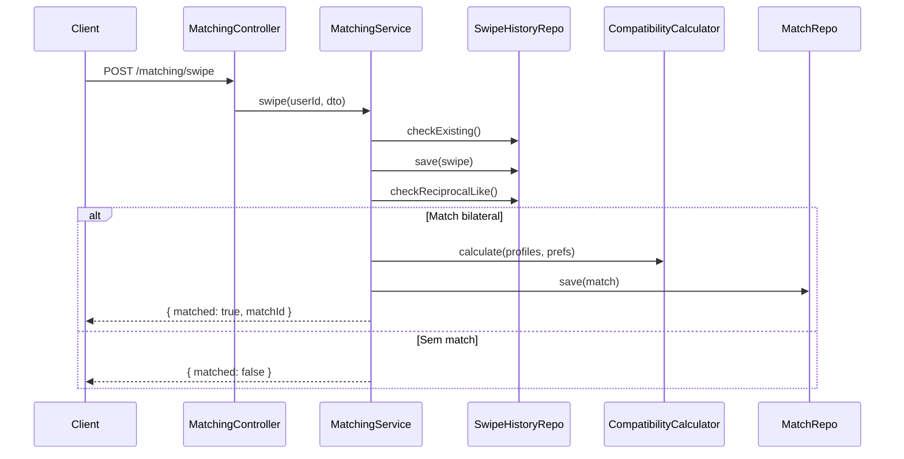

# System Feature Flows — WellMatch

> Registro historico e incremental dos fluxos internos de cada funcionalidade.
> Este documento cresce a cada nova feature implementada e nunca tem secoes removidas.

---

## Indice

- [Visao Geral da Arquitetura](#visao-geral-da-arquitetura)
- [Feature: Autenticacao e Registro](#feature-autenticacao-e-registro)
- [Feature: Ingestao de Metricas de Saude](#feature-ingestao-de-metricas-de-saude)
- [Feature: Geracao de Perfil Derivado](#feature-geracao-de-perfil-derivado)
- [Feature: Sistema de Swipe e Match](#feature-sistema-de-swipe-e-match)
- [Feature: Chat em Tempo Real](#feature-chat-em-tempo-real)
- [Feature: Privacidade e LGPD](#feature-privacidade-e-lgpd)

---

## Visao Geral da Arquitetura

**Padrao arquitetural:** Modular (NestJS Modules) com separacao por dominio de negocio.

**Fluxo global de uma requisicao:**

```
HTTP Request
    └── Controller (NestJS Controller)
            └── Service (Business Logic)
                    ├── Repository (TypeORM)
                    │         └── PostgreSQL / TimescaleDB
                    └── Provider / Processor (HealthProvider, CompatibilityCalculator)
```

**Camadas:**

| Camada | Responsabilidade |
|--------|-----------------|
| Controller | Receber requisicoes, validar DTOs, retornar resposta |
| Service | Orquestrar regras de negocio e persistencia |
| Repository | Acesso a dados via TypeORM |
| Provider | Abstrair fontes externas (smartwatch, simulado) |
| Processor | Transformar dados brutos em dados derivados seguros |

---

## Feature: Autenticacao e Registro

> **Versao:** 1.0.0
> **Implementada em:** 2026-05-07
> **Status:** Concluida

### Resumo
Permite criar conta com email/senha e autenticar via JWT. Nenhuma integracao externa de auth no MVP.

**Motivacao:** Controle total sobre dados do usuario sem depender de servicos de terceiros.
**Resultado:** Sistema de autenticacao JWT funcional com hash de senha bcrypt.

### Fluxo Principal — Registro

1. `POST /auth/register` com `{ email, password, name, ... }`
2. `AuthController.register()` chama `AuthService.register()`
3. `UsersService.create()` verifica email duplicado e hash da senha (bcrypt, 12 rounds)
4. Salva `User` e cria `UserPreferences` com defaults
5. Retorna JWT + dados basicos do usuario

### Fluxo Principal — Login

1. `POST /auth/login` com `{ email, password }`
2. `LocalStrategy.validate()` busca usuario e compara senha
3. `AuthService.login()` gera JWT com payload `{ sub: id, email }`
4. Retorna `access_token`, `token_type`, `expires_in`

### Regras de Negocio

| Regra | Descricao | Localizacao |
|-------|-----------|------------|
| Email unico | Erro 409 se email ja cadastrado | `users.service.ts` |
| Senha minima | Minimo 8 caracteres (validado no DTO) | `create-user.dto.ts` |
| Hash bcrypt | 12 rounds configuravel via env | `users.service.ts` |
| Exclusao logica | `is_deleted=true` impede login | `jwt.strategy.ts` |

---

## Feature: Ingestao de Metricas de Saude

> **Versao:** 1.0.0
> **Implementada em:** 2026-05-07
> **Status:** Concluida

### Resumo
Importa dados do smartwatch (ou simulados) via `HealthProvider` abstrato. Dados brutos sao armazenados em tabela protegida e nunca retornados via API publica.

**Motivacao:** Permitir ingestao de dados de multiplos provedores sem acoplar o backend a nenhum especifico.
**Resultado:** Camada `HealthProvider` com provider simulado funcional para o MVP.

### Fluxo Principal

1. `POST /health/ingest` com `{ provider, fromDate, toDate }`
2. `HealthService.ingestMetrics()` verifica consentimentos ativos do usuario
3. `HealthProviderFactory.getProvider(name)` retorna provider correto
4. `provider.fetchMetrics(userId, from, to)` retorna array de `RawHealthMetrics`
5. Salva em `health_metrics_raw` (tabela protegida, acesso apenas interno)
6. `HealthProfileProcessor.processMetrics()` gera perfil derivado por dia
7. Salva em `health_profile_daily` via upsert

### Privacidade

- `health_metrics_raw` nunca retornada em endpoints publicos
- Todos os endpoints de saude requerem JWT
- Consentimento explicitamente verificado antes de ingestao

### Fluxo do SimulatedProvider

```
hashUserId(userId) → seed numerico
for each day in [from, to]:
    seededRandom(seed + dayIndex) → steps, calories, heartRate, etc.
    retorna RawHealthMetrics[] com dados consistentes por usuario
```

---

## Feature: Geracao de Perfil Derivado

> **Versao:** 1.0.0
> **Implementada em:** 2026-05-07
> **Status:** Concluida

### Resumo
Converte metricas brutas em bandas semanticas seguras. Este e o nucleo da privacidade do produto.

### Mapeamento de Bandas

| Metrica Bruta | Banda Derivada | Valores |
|---------------|----------------|---------|
| steps < 3000 | very_low | — |
| steps 3000-6000 | low | — |
| steps 6000-9000 | moderate | — |
| steps 9000-12000 | high | — |
| steps > 12000 | very_high | — |
| sleep_score 0-40 | poor | — |
| sleep_score 40-60 | fair | — |
| sleep_score 60-75 | good | — |
| sleep_score 75-85 | great | — |
| sleep_score > 85 | excellent | — |
| stress_level 0-30 | low | — |
| stress_level 30-60 | moderate | — |
| stress_level 60-80 | high | — |
| stress_level > 80 | very_high | — |

### Score de Consistencia

Score 0-100 baseado no coeficiente de variacao (CV) dos passos diarios:
`consistencyScore = max(0, min(100, (1 - CV) * 100))`

---

## Feature: Sistema de Swipe e Match

> **Versao:** 1.0.0
> **Implementada em:** 2026-05-07
> **Status:** Concluida

### Resumo
Sistema de like/dislike com verificacao bilateral de match e rate limiting.

### Fluxo de Swipe

1. `POST /matching/swipe` com `{ targetUserId, direction }`
2. Verifica se usuario nao esta dando swipe em si mesmo
3. Verifica rate limit (50 swipes/dia)
4. Verifica se ja havia swipe anterior (unicidade)
5. Salva `SwipeHistory`
6. Se direction = 'like': verifica se target ja deu like de volta
7. Se match bilateral: calcula score de compatibilidade e cria `Match`

### Algoritmo de Compatibilidade

```
score = goals(0.25) + activities(0.20) + chronotype(0.15)
      + intensity(0.15) + availability(0.10) + distance(0.10) + consistency(0.05)
```

Cada dimensao normalizada 0-100. Score final arredondado para inteiro.

### Diagrama de Sequencia



---

## Feature: Chat em Tempo Real

> **Versao:** 1.0.0
> **Implementada em:** 2026-05-07
> **Status:** Concluida

### Resumo
Chat via WebSocket (Socket.IO) com fallback REST. Autenticacao via JWT no handshake.

### Eventos WebSocket

| Evento | Direcao | Payload |
|--------|---------|---------|
| `join:match` | Client → Server | `{ matchId }` |
| `message:send` | Client → Server | `{ matchId, message }` |
| `message:received` | Server → Client | `ChatMessage` |
| `match:new` | Server → Client | `{ matchId }` |

### Sugestoes de Conversa

O `ChatService.getWellnessSuggestions(matchId)` retorna frases baseadas em dados compartilhados do match, como:
- "Voces dois tem rotina matinal. Que tal combinar uma caminhada?"
- "Voces compartilham o objetivo de melhorar o condicionamento."

---

## Feature: Privacidade e LGPD

> **Versao:** 1.0.0
> **Implementada em:** 2026-05-07
> **Status:** Concluida

### Resumo
Implementa todos os direitos do titular de dados segundo a LGPD.

### Endpoints

| Metodo | Rota | Acao |
|--------|------|------|
| GET | `/health/consent` | Lista todos os consentimentos |
| POST | `/health/consent/grant` | Concede consentimento por metrica |
| POST | `/health/consent/revoke` | Revoga consentimento por metrica |
| GET | `/privacy/export` | Exporta todos os dados do usuario (JSON) |
| DELETE | `/privacy/health-data` | Remove dados de saude e perfil derivado |
| DELETE | `/privacy/account` | Anonimiza conta e remove todos os dados |

### Anonimizacao de Conta

Na exclusao, o usuario tem:
- email substituido por `deleted_{id}@wellmatch.invalid`
- nome substituido por "Deleted User"
- bio, regiao, avatar removidos
- `is_deleted = true`, `deleted_at = now()`

Dados de saude brutos e derivados sao fisicamente removidos.

### Audit Trail

Todos os eventos de consentimento sao registrados em `consent_records` com:
- `metric_type` — qual metrica
- `permission_status` — granted / revoked
- `granted_at` / `revoked_at` — timestamps precisos
- `source_provider` — de onde veio o dado
