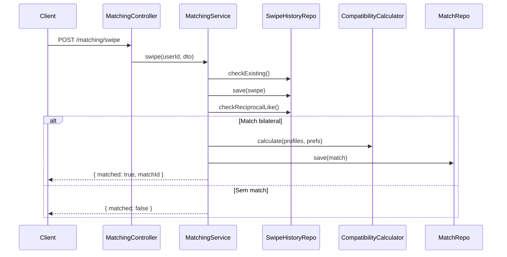

# System Feature Flows — WellMatch

> Registro historico e incremental dos fluxos internos de cada funcionalidade.
> Este documento cresce a cada nova feature implementada e nunca tem secoes removidas.

---

## Indice

- [Visao Geral da Arquitetura](#visao-geral-da-arquitetura)
- [Feature: Autenticacao e Registro](#feature-autenticacao-e-registro)
- [Feature: Ingestao de Metricas de Saude](#feature-ingestao-de-metricas-de-saude)
- [Feature: Geracao de Perfil Derivado](#feature-geracao-de-perfil-derivado)
- [Feature: Sistema de Swipe e Match](#feature-sistema-de-swipe-e-match)
- [Feature: Chat em Tempo Real](#feature-chat-em-tempo-real)
- [Feature: Privacidade e LGPD](#feature-privacidade-e-lgpd)
- [Feature: Onboarding Multi-Step](#feature-onboarding-multi-step)
- [Feature: Moderacao e Bloqueio](#feature-moderacao-e-bloqueio)
- [Feature: Chat Seguro](#feature-chat-seguro)

---

## Visao Geral da Arquitetura

**Padrao arquitetural:** Modular (NestJS Modules) com separacao por dominio de negocio.

**Fluxo global de uma requisicao:**

```
HTTP Request
    └── Controller (NestJS Controller)
            └── Service (Business Logic)
                    ├── Repository (TypeORM)
                    │         └── PostgreSQL / TimescaleDB
                    └── Provider / Processor (HealthProvider, CompatibilityCalculator)
```

**Camadas:**

| Camada | Responsabilidade |
|--------|-----------------|
| Controller | Receber requisicoes, validar DTOs, retornar resposta |
| Service | Orquestrar regras de negocio e persistencia |
| Repository | Acesso a dados via TypeORM |
| Provider | Abstrair fontes externas (smartwatch, simulado) |
| Processor | Transformar dados brutos em dados derivados seguros |

---

## Feature: Autenticacao e Registro

> **Versao:** 1.0.0
> **Implementada em:** 2026-05-07
> **Status:** Concluida

### Resumo
Permite criar conta com email/senha e autenticar via JWT. Nenhuma integracao externa de auth no MVP.

**Motivacao:** Controle total sobre dados do usuario sem depender de servicos de terceiros.
**Resultado:** Sistema de autenticacao JWT funcional com hash de senha bcrypt.

### Fluxo Principal — Registro

1. `POST /auth/register` com `{ email, password, name, ... }`
2. `AuthController.register()` chama `AuthService.register()`
3. `UsersService.create()` verifica email duplicado e hash da senha (bcrypt, 12 rounds)
4. Salva `User` e cria `UserPreferences` com defaults
5. Retorna JWT + dados basicos do usuario

### Fluxo Principal — Login

1. `POST /auth/login` com `{ email, password }`
2. `LocalStrategy.validate()` busca usuario e compara senha
3. `AuthService.login()` gera JWT com payload `{ sub: id, email }`
4. Retorna `access_token`, `token_type`, `expires_in`

### Regras de Negocio

| Regra | Descricao | Localizacao |
|-------|-----------|------------|
| Email unico | Erro 409 se email ja cadastrado | `users.service.ts` |
| Senha minima | Minimo 8 caracteres (validado no DTO) | `create-user.dto.ts` |
| Hash bcrypt | 12 rounds configuravel via env | `users.service.ts` |
| Exclusao logica | `is_deleted=true` impede login | `jwt.strategy.ts` |

---

## Feature: Ingestao de Metricas de Saude

> **Versao:** 1.0.0
> **Implementada em:** 2026-05-07
> **Status:** Concluida

### Resumo
Importa dados do smartwatch (ou simulados) via `HealthProvider` abstrato. Dados brutos sao armazenados em tabela protegida e nunca retornados via API publica.

**Motivacao:** Permitir ingestao de dados de multiplos provedores sem acoplar o backend a nenhum especifico.
**Resultado:** Camada `HealthProvider` com provider simulado funcional para o MVP.

### Fluxo Principal

1. `POST /health/ingest` com `{ provider, fromDate, toDate }`
2. `HealthService.ingestMetrics()` verifica consentimentos ativos do usuario
3. `HealthProviderFactory.getProvider(name)` retorna provider correto
4. `provider.fetchMetrics(userId, from, to)` retorna array de `RawHealthMetrics`
5. Salva em `health_metrics_raw` (tabela protegida, acesso apenas interno)
6. `HealthProfileProcessor.processMetrics()` gera perfil derivado por dia
7. Salva em `health_profile_daily` via upsert

### Privacidade

- `health_metrics_raw` nunca retornada em endpoints publicos
- Todos os endpoints de saude requerem JWT
- Consentimento explicitamente verificado antes de ingestao

### Fluxo do SimulatedProvider

```
hashUserId(userId) → seed numerico
for each day in [from, to]:
    seededRandom(seed + dayIndex) → steps, calories, heartRate, etc.
    retorna RawHealthMetrics[] com dados consistentes por usuario
```

---

## Feature: Geracao de Perfil Derivado

> **Versao:** 1.0.0
> **Implementada em:** 2026-05-07
> **Status:** Concluida

### Resumo
Converte metricas brutas em bandas semanticas seguras. Este e o nucleo da privacidade do produto.

### Mapeamento de Bandas

| Metrica Bruta | Banda Derivada | Valores |
|---------------|----------------|---------|
| steps < 3000 | very_low | — |
| steps 3000-6000 | low | — |
| steps 6000-9000 | moderate | — |
| steps 9000-12000 | high | — |
| steps > 12000 | very_high | — |
| sleep_score 0-40 | poor | — |
| sleep_score 40-60 | fair | — |
| sleep_score 60-75 | good | — |
| sleep_score 75-85 | great | — |
| sleep_score > 85 | excellent | — |
| stress_level 0-30 | low | — |
| stress_level 30-60 | moderate | — |
| stress_level 60-80 | high | — |
| stress_level > 80 | very_high | — |

### Score de Consistencia

Score 0-100 baseado no coeficiente de variacao (CV) dos passos diarios:
`consistencyScore = max(0, min(100, (1 - CV) * 100))`

---

## Feature: Sistema de Swipe e Match

> **Versao:** 1.0.0
> **Implementada em:** 2026-05-07
> **Status:** Concluida

### Resumo
Sistema de like/dislike com verificacao bilateral de match e rate limiting.

### Fluxo de Swipe

1. `POST /matching/swipe` com `{ targetUserId, direction }`
2. Verifica se usuario nao esta dando swipe em si mesmo
3. Verifica rate limit (50 swipes/dia)
4. Verifica se ja havia swipe anterior (unicidade)
5. Salva `SwipeHistory`
6. Se direction = 'like': verifica se target ja deu like de volta
7. Se match bilateral: calcula score de compatibilidade e cria `Match`

### Algoritmo de Compatibilidade

```
score = goals(0.25) + activities(0.20) + chronotype(0.15)
      + intensity(0.15) + availability(0.10) + distance(0.10) + consistency(0.05)
```

Cada dimensao normalizada 0-100. Score final arredondado para inteiro.

### Dados do Card de Candidato (v0.3.0)

Cada candidato retornado em `GET /matching/candidates` agora inclui:

| Campo | Origem | Descricao |
|-------|--------|-----------|
| `displayName` | users.name | Nome de exibicao do usuario |
| `ageRange` | Calculado de users.birthdate | Faixa etaria (ex: "25-29", "30-34") |
| `approximateRegion` | users.locationRegion | Regiao textual aproximada |
| `score_confidence` | public_wellness_profile | low / medium / high |
| `source` | public_wellness_profile | manual / health_connect / healthkit / mixed |
| `badges` | public_wellness_profile | Badges de consistencia e conquistas |

O `WellnessCard` no mobile exibe: `displayName`, `ageRange`, confidence badge (conforme `score_confidence`) e source badge (conforme `source`).

### Rate Limit de Swipe (v0.3.0)

Corrigido B002: o rate limit agora conta `createdAt >= todayStart` com `MoreThanOrEqual` (anteriormente contava total historico, bloqueando usuarios apos 50 swipes acumulados).

### Diagrama de Sequencia



---

## Feature: Chat em Tempo Real

> **Versao:** 1.0.0
> **Implementada em:** 2026-05-07
> **Status:** Concluida

### Resumo
Chat via WebSocket (Socket.IO) com fallback REST. Autenticacao via JWT no handshake.

### Eventos WebSocket

| Evento | Direcao | Payload |
|--------|---------|---------|
| `join:match` | Client → Server | `{ matchId }` |
| `message:send` | Client → Server | `{ matchId, message }` |
| `message:received` | Server → Client | `ChatMessage` |
| `match:new` | Server → Client | `{ matchId }` |

### Sugestoes de Conversa

O `ChatService.getWellnessSuggestions(matchId)` retorna frases baseadas em dados compartilhados do match, como:
- "Voces dois tem rotina matinal. Que tal combinar uma caminhada?"
- "Voces compartilham o objetivo de melhorar o condicionamento."

---

## Feature: Privacidade e LGPD

> **Versao:** 1.0.0
> **Implementada em:** 2026-05-07
> **Status:** Concluida

### Resumo
Implementa todos os direitos do titular de dados segundo a LGPD.

### Endpoints

| Metodo | Rota | Acao |
|--------|------|------|
| GET | `/health/consent` | Lista todos os consentimentos |
| POST | `/health/consent/grant` | Concede consentimento por metrica |
| POST | `/health/consent/revoke` | Revoga consentimento por metrica |
| GET | `/privacy/export` | Exporta todos os dados do usuario (JSON) |
| DELETE | `/privacy/health-data` | Remove dados de saude e perfil derivado |
| DELETE | `/privacy/account` | Anonimiza conta e remove todos os dados |

### Anonimizacao de Conta

Na exclusao, o usuario tem:
- email substituido por `deleted_{id}@wellmatch.invalid`
- nome substituido por "Deleted User"
- bio, regiao, avatar removidos
- `is_deleted = true`, `deleted_at = now()`

Dados de saude brutos e derivados sao fisicamente removidos.

### Audit Trail

Todos os eventos de consentimento sao registrados em `consent_records` com:
- `metric_type` — qual metrica
- `permission_status` — granted / revoked
- `purpose` — finalidade do consentimento
- `consent_version` — versao da politica
- `granted_at` / `revoked_at` — timestamps precisos
- `source_provider` — de onde veio o dado

### Efeito da Revogacao (v0.2.0)

Quando um consentimento e revogado:

1. Status do consentimento → 'revoked', revoked_at preenchido
2. Campos associados em `public_wellness_profile` → null (via metricToField mapping)
3. `score_confidence` → 'low'
4. Proximo calculo de compatibilidade usa menos dimensoes, com confianca reduzida

---

## Feature: Onboarding Multi-Step

> **Versao:** 1.0.0
> **Implementada em:** 2026-07-04
> **Status:** Concluida

### Resumo
Onboarding obrigatorio de 7 passos apos registro. Usuario so acessa matching apos `onboarding_completed = true`.

### Fluxo

```
POST /auth/register
    → users + user_preferences criados
    → redirecionar para onboarding (step 0)

Step 1: POST /users/onboarding/step1  → mainIntention
Step 2: POST /users/onboarding/step2  → wellnessGoals
Step 3: POST /users/onboarding/step3  → preferredActivities
Step 4: POST /users/onboarding/step4  → availabilityPeriods
Step 5: POST /users/onboarding/step5  → intensityPreference
Step 6: POST /users/onboarding/step6  → privacyVisibilitySettings
Step 7: POST /users/onboarding/step7  → source + manual bands → gera PublicWellnessProfile

GET /users/onboarding/status → { completed: boolean, step: number, profile }
```

### Validacoes
- Steps 1-6 sao upserts idempotentes
- Step 7 exige steps 1-6 completos (400 caso contrario)
- Step 7 gera PublicWellnessProfile com `onboardingCompleted: true`

### Dados gerados no Step 7
- activityLevel, sleepRoutineBand, chronotypeBand mapeados de respostas manuais
- score_confidence = 'medium' para manual, 'low' para simulado
- intensityPreference, preferredActivities, wellnessGoals, availabilityPeriods copiados de user_preferences

---

## Feature: Moderacao e Bloqueio

> **Versao:** 1.0.0
> **Implementada em:** 2026-07-04
> **Status:** Concluida

### Resumo
Sistema completo de bloqueio, denuncia e acoes de moderacao com persistencia e ciclo de vida.

### Fluxo de Bloqueio

1. `POST /moderation/block` com `{ targetUserId, reason? }`
2. Verifica se nao esta bloqueando a si mesmo
3. Verifica se bloqueio ja existe (idempotente)
4. Atualiza matches ativos entre os dois → status 'blocked'
5. Persiste Block

### Fluxo de Denuncia

1. `POST /moderation/report` com `{ targetUserId, reason, description?, matchId? }`
2. Verifica se nao esta denunciando a si mesmo
3. Cria Report com status 'pending'
4. Moderador analisa e pode: alterar status, aplicar moderation action

### Regras

| Regra | Descricao |
|-------|-----------|
| Auto-block | Rejeitado (400) |
| Auto-report | Rejeitado (400) |
| Block duplicado | Retorna block existente (idempotente) |
| Match ativo | Bloqueio → match status = 'blocked' |
| Visibilidade | Usuario ve apenas proprias denuncias (admin ve todas) |

---

## Feature: Chat Seguro

> **Versao:** 2.0.0
> **Implementada em:** 2026-07-04
> **Status:** Concluida (atualizada)

### Melhorias de Seguranca (v0.2.0)

- `join:match` agora valida participacao no match (antes permitia join em qualquer matchId)
- `message:send` valida acesso server-side antes de persistir
- Limite diario de mensagens: 200 (configuravel via DAILY_MESSAGE_LIMIT)
- `read_at` timestamp adicionado ao marcar como lida
- Sugestoes de conversa usam hash melhorado (corrigido B003)

### Eventos WebSocket (atualizado)

| Evento | Direcao | Payload | Seguranca |
|--------|---------|---------|-----------|
| `join:match` | Client → Server | `{ matchId }` | Validacao de participacao |
| `message:send` | Client → Server | `{ matchId, message }` | Validacao de acesso + rate limit |
| `message:read` | Client → Server | `{ matchId, messageId }` | Marcar como lida com timestamp |
| `message:received` | Server → Client | `ChatMessage` | — |
| `match:new` | Server → Client | `{ matchId }` | — |

### Telas Mobile de Moderacao (v0.2.0)

#### BlockedUsersScreen

> **Implementada em:** 2026-07-04
> **Status:** Concluida

Lista todos os usuarios bloqueados pelo usuario atual com opcao de desbloqueio.

**Fluxo:**
1. Ao montar: `moderationService.getBlocks()` → lista de `Block[]`
2. Renderiza cada block com: `blockedId` truncado ("Usuário {id.slice(0,8)}..."), `reason` (se houver), `createdAt` formatado
3. Botao "Desbloquear" → `moderationService.unblockUser(blockedId)` → remove da lista
4. Estados: loading (ActivityIndicator), empty ("Nenhum usuário bloqueado"), error (mensagem + retry)

**Arquivo:** `mobile/src/screens/moderation/BlockedUsersScreen.tsx`

#### ReportUserScreen

> **Implementada em:** 2026-07-04
> **Status:** Concluida

Permite denunciar um usuario com motivo e descricao opcional.

**Fluxo:**
1. Recebe `route.params.targetUserId` (obrigatorio) e `matchId` (opcional)
2. Usuario seleciona 1 motivo entre 7 opcoes (radio buttons)
3. Descricao opcional multiline (max 500 chars)
4. "Enviar denúncia" → `moderationService.reportUser(...)` → alerta de sucesso → `navigation.goBack()`
5. Estados: loading no botao, erro de validacao (motivo nao selecionado), erro de API

**Arquivo:** `mobile/src/screens/moderation/ReportUserScreen.tsx`

#### BlockUserButton

> **Implementada em:** 2026-07-04
> **Status:** Concluida

Componente reutilizavel que abre Alert de confirmacao antes de bloquear.

**Props:** `targetUserId: string`, `onBlock?: () => void`
**Fluxo:**
1. Renderiza `Button` variant="danger", label="Bloquear usuário"
2. On press: `Alert.alert("Bloquear usuário?", "Ele não poderá mais aparecer...")`
3. Confirm → `moderationService.blockUser(targetUserId)` → alerta "Usuário bloqueado com sucesso" → `onBlock?.()`
4. Loading/disabled durante a chamada

**Arquivo:** `mobile/src/components/moderation/BlockUserButton.tsx`

---

## Feature: Onboarding Screens (Mobile)

> **Versao:** 2.0.0
> **Implementada em:** 2026-07-04
> **Status:** Concluida (atualizada)

### Resumo
Telas React Native do onboarding multi-step completo (9 telas), implementando os passos 1 a 7 mais introducao e conclusao. Consomem `onboardingService` e navegam sequencialmente atraves do `OnboardingNavigator`.

### Telas

| Tela | Rota | Step | Descricao |
|------|------|------|-----------|
| OnboardingIntro | `OnboardingIntro` | — | Boas-vindas com logo e descricao do app |
| OnboardingIntent | `OnboardingIntent` | 1/7 | Selecao unica de intencao principal |
| OnboardingGoals | `OnboardingGoals` | 2/7 | Multi-selecao de objetivos de bem-estar |
| OnboardingActivities | `OnboardingActivities` | 3/7 | Multi-selecao de atividades preferidas |
| OnboardingAvailability | `OnboardingAvailability` | 4/7 | Multi-selecao de periodos de disponibilidade |
| OnboardingIntensity | `OnboardingIntensity` | 5/7 | Selecao unica de intensidade preferida |
| OnboardingPrivacy | `OnboardingPrivacy` | 6/7 | Configuracoes de visibilidade e privacidade |
| OnboardingSource | `OnboardingSource` | 7/7 | Origem dos dados (manual / smartwatch) + confirmacao final |
| OnboardingCompleted | `OnboardingCompleted` | — | Tela de conclusao com animacao e acao para comecar |

### Fluxo de Navegacao

```
OnboardingIntro → OnboardingIntent → OnboardingGoals → OnboardingActivities
    → OnboardingAvailability → OnboardingIntensity → OnboardingPrivacy
    → OnboardingSource → OnboardingCompleted → App (Match)
```

### OnboardingNavigator

- `OnboardingNavigator` gerencia a pilha de telas de onboarding
- `AppNavigator` verifica `onboardingCompleted` no estado global (auth.store.ts)
- Se `onboardingCompleted = false` apos login/register, redireciona para `OnboardingNavigator`
- `auth.store.ts` inclui `onboardingCompleted: boolean` e `checkOnboardingStatus()` que chama `GET /users/onboarding/status`

### Padrao de Componente

Cada tela segue o mesmo padrao:
- `ScrollView` com `contentContainerStyle` para scroll
- Indicador "Passo X de 7" no topo
- Titulo e subtitulo com `typography`
- Opcoes em cards com `colors.surfaceElevated` e `colors.border`
- Card selecionado: `colors.primary` no border + `colors.primaryDim` no fundo
- Radio (single-select) ou checkbox (multi-select) animado
- `Button` component com `disabled` ate preencher requisito minimo
- `loading` state que desabilita o botao e mostra `ActivityIndicator`
- `error` state exibido como texto centralizado em `colors.error`
- Chamada a `onboardingService.saveStepN()` + `navigation.navigate('ProximaRota')`

### Estados

| Estado | Comportamento |
|--------|---------------|
| Initial | Opcoes livres para toque, botao disabled se nenhuma selecionada |
| Loading | Botao mostra spinner, toque bloqueado |
| Error | Mensagem em vermelho exibida acima do botao |
| Success | Navega para proxima tela |

### Arquivos

- Telas: `mobile/src/screens/onboarding/IntroScreen.tsx`, `IntentScreen.tsx`, `GoalsScreen.tsx`, `ActivitiesScreen.tsx`, `AvailabilityScreen.tsx`, `IntensityScreen.tsx`, `PrivacyScreen.tsx`, `SourceScreen.tsx`, `CompletedScreen.tsx`
- Navegador: `mobile/src/navigation/OnboardingNavigator.tsx`
- Servico: `mobile/src/services/onboarding.service.ts`
- Store: `mobile/src/store/auth.store.ts`

---

---

## Feature: Audit Module

> **Versao:** 1.0.0
> **Implementada em:** 2026-07-04
> **Status:** Concluida

### Resumo
Registro centralizado de eventos importantes do sistema para rastreabilidade e conformidade LGPD.

### Eventos Auditados

| Servico | Eventos |
|---------|---------|
| AuthService | user_registered, login_success, login_failed |
| OnboardingService | onboarding_completed |
| HealthService | consent_granted, consent_revoked |
| PrivacyService | privacy_export_requested, health_data_deleted, account_deleted |
| ModerationService | user_blocked, user_unblocked, user_reported, moderation_action_taken |
| MatchingService | match_created |
| ChatService | message_sent, message_read |
| PrivacyRetentionService | retention_cleanup_executed |

### Fluxo

1. Servico de negocio executa acao (ex: `AuthService.register()`)
2. Servico chama `this.auditService.record({ userId, eventType, resourceType, resourceId, metadata, ipAddress })`
3. `AuditService` persiste `AuditEvent` na tabela `audit_events`
4. Evento e imutavel — nunca editado ou removido

### Estrutura do Evento

```typescript
{
  userId: string | null,
  eventType: 'user_registered' | 'login_success' | ...,
  resourceType: string | null,   // 'user', 'match', 'report', etc.
  resourceId: string | null,     // UUID do recurso afetado
  metadata: Record<string, any> | null,  // JSONB com dados contextuais
  ipAddress: string | null,
  createdAt: Date
}
```

---

## Feature: Healthcheck e Readiness

> **Versao:** 1.0.0
> **Implementada em:** 2026-07-04
> **Status:** Concluida

### Resumo
Endpoints de saude operacional para monitoramento e orquestracao (Kubernetes, Docker healthcheck, load balancer).

### Endpoints

| Metodo | Rota | Descricao | Auth |
|--------|------|-----------|------|
| GET | `/health` | Retorna `{ status: 'ok', timestamp }` | Nao |
| GET | `/ready` | Verifica conectividade com banco e Redis | Nao |

### Fluxo

1. `GET /health` — sempre retorna 200, usado para liveness probe
2. `GET /ready` — tenta conectar no PostgreSQL e Redis, retorna 200 se ambos OK, 503 caso contrario
3. Implementado em `HealthCheckController` (`src/modules/health-check`)

---

## Feature: Logging Estruturado

> **Versao:** 1.0.0
> **Implementada em:** 2026-07-04
> **Status:** Concluida

### Resumo
Interceptor global para logging estruturado de todas as requisicoes HTTP.

### Fluxo

1. `LoggingInterceptor` implementa `NestInterceptor`
2. Intercepta toda requisicao HTTP
3. Registra: metodo, path, status code, duracao (ms), userId (se autenticado), timestamp
4. Campos sensiveis (password, token, authorization) sao automaticamente redactados
5. Saida em formato JSON estruturado para consumo por ferramentas de log (ELK, Datadog, etc.)

---

## Feature: Retencao Automatica de Dados

> **Versao:** 1.0.0
> **Implementada em:** 2026-07-04
> **Status:** Concluida

### Resumo
Cron job diario para limpeza de dados expirados, garantindo conformidade com politica de retencao.

### Fluxo

1. `PrivacyRetentionService` agendado com `@Cron('0 3 * * *')` (03:00 todos os dias)
2. Remove `health_metrics_raw` com `timestamp < 90 dias atras`
3. Remove `audit_events` com `created_at < 1 ano atras` (eventos muito antigos)
4. Remove `chat_messages` de matches bloqueados ha mais de 30 dias
5. Registra evento `retention_cleanup_executed` no AuditModule

### Dependencia

- `@nestjs/schedule` adicionado ao `AppModule`
- `ScheduleModule.forRoot()` importado no modulo raiz

---

## Feature: Smartwatch Providers (v0.3.0)

> **Versao:** 1.0.0
> **Implementada em:** 2026-07-04
> **Status:** Concluida

### Resumo
Camada de provedores de saude expandida com 4 implementacoes reais de smartwatch/API.

### Arquitetura

```
HealthProvider (interface)
├── SimulatedProvider   — dados sinteticos (sempre disponivel)
├── HealthKitProvider   — Apple HealthKit (iOS, retorna false se nao for iOS)
├── HealthConnectProvider — Android Health Connect (retorna false se nao for Android)
├── GarminProvider      — Garmin Connect API (disponivel se GARMIN_CLIENT_ID/SECRET setados)
└── FitbitProvider      — Fitbit Web API (disponivel se FITBIT_CLIENT_ID/SECRET setados)
```

### Estrategia de Disponibilidade

| Provider | isAvailable() | Condicao |
|----------|---------------|----------|
| Simulado | `true` | Sempre |
| HealthKit | `false` | Apenas nativo iOS (MVP nao roda nativo) |
| Health Connect | `false` | Apenas nativo Android (MVP nao roda nativo) |
| Garmin | `true` se env vars configuradas | GARMIN_CLIENT_ID + GARMIN_CLIENT_SECRET |
| Fitbit | `true` se env vars configuradas | FITBIT_CLIENT_ID + FITBIT_CLIENT_SECRET |

### Fluxo de requestPermissions

Garmin e Fitbit simulam OAuth retornando todas as permissoes como `true`.
HealthKit e Health Connect retornam `false` (plataforma nao disponivel).

### Factory

O `HealthProviderFactory` registra todos os 5 provedores e os retorna pelo nome:

- `'simulated'` → SimulatedProvider
- `'healthkit'` → HealthKitProvider
- `'health_connect'` → HealthConnectProvider
- `'garmin'` → GarminProvider
- `'fitbit'` → FitbitProvider

### Arquivos

- `backend/src/modules/health/providers/healthkit.provider.ts`
- `backend/src/modules/health/providers/health-connect.provider.ts`
- `backend/src/modules/health/providers/garmin.provider.ts`
- `backend/src/modules/health/providers/fitbit.provider.ts`
- `backend/src/modules/health/providers/health-provider.factory.ts` (atualizado)
- `backend/src/modules/health/health.module.ts` (registro dos providers)

---

### Metodo getWellnessSuggestions (v2)

```
hash = simpleHash(matchId)  // hash melhorado (shift+add+XOR)
for i in [0, 7, 14]:
    suggestion = corpus[(hash + i) % corpus.length]
    result.push(suggestion)
```

Evita colisoes do metodo anterior (charCodeAt(0) gerava sempre as mesmas 2 sugestoes para matches comecando com a mesma letra).

---

## Feature: Profile Screen (Mobile)

> **Versao:** 1.0.0
> **Implementada em:** 2026-07-04
> **Status:** Concluida

### Resumo
Tela de perfil do usuario que exibe informacoes pessoais (nome, email via `useAuthStore`) e o perfil publico de bem-estar (`PublicWellnessProfile`) obtido via `onboardingService.getWellnessProfile()`.

### Layout
- Cabecalho com avatar inicial, nome e email
- Card "Seu Perfil Publico de Bem-Estar" com nota de privacidade
- Campos exibidos como linhas label + valor: Intencao principal, Nivel de atividade, Consistencia, Rotina de sono, Cronotipo, Intensidade preferida
- Arrays (atividades, objetivos, periodos, badges) exibidos como tags/chips
- Campos nulos mostram "Nao informado" em cor muted
- Menu de navegacao: Privacidade, Smartwatch, Exportar dados, Excluir conta, Sair

### Estados
| Estado | Comportamento |
|--------|---------------|
| Loading | `ActivityIndicator` centralizado |
| Error | Mensagem de erro + botao "Tentar novamente" |
| Empty (profile null) | Card "Complete o onboarding primeiro" + botao "Ir para o onboarding" |
| Sucesso | Lista completa de campos do perfil |

### Arquivo
`mobile/src/screens/profile/ProfileScreen.tsx`

---

## Feature: Match Screen (Mobile) — Botoes de Moderacao

> **Versao:** 1.0.0
> **Implementada em:** 2026-07-04
> **Status:** Concluida

### Resumo
Adiciona botoes de moderacao ("Denunciar" e "Bloquear") abaixo do card stack na tela de match, visiveis apenas quando ha candidatos disponiveis.

### Fluxo
1. MatchScreen carrega candidatos via `matchingService.getCandidates()`
2. Quando `candidates.length > 0`, exibe botoes like/dislike + linha de moderacao
3. "Denunciar": `TouchableOpacity` estilo ghost -> `navigation.navigate('ReportUser', { targetUserId })`
4. "Bloquear": Componente `BlockUserButton` inline com `targetUserId` do candidato atual

### Arquivo
`mobile/src/screens/match/MatchScreen.tsx`

---

## Feature: Unmatch

> **Versao:** 1.0.0
> **Implementada em:** 2026-07-04
> **Status:** Concluida

### Resumo
Permite que um usuario desfaça um match ativo, alterando o status para 'unmatched' e registrando auditoria.

### Fluxo

1. `DELETE /matching/unmatch/:matchId` autenticado
2. `MatchingController.unmatch()` chama `MatchingService.unmatch(userId, matchId)`
3. Busca o match pelo id — 404 se nao encontrado
4. Verifica se o usuario requisitante e participante — 400 caso contrario
5. Altera `status` para `'unmatched'`
6. Persiste no banco
7. Registra evento `match_unmatched` no AuditModule

### Regras

| Regra | Descricao |
|-------|-----------|
| Participacao | So pode desfazer match quem participa dele |
| Match inexistente | Retorna 404 |
| Idempotencia | Chamar novamente retorna 404 (match nao esta mais ativo na busca) |

---

## Feature: Geolocation Distance Filtering

> **Versao:** 1.0.0
> **Implementada em:** 2026-07-04
> **Status:** Concluida

### Resumo
Candidatos sao filtrados por distancia geografica real usando coordenadas de latitude/longitude quando disponiveis.

### Modelo

- Colunas `latitude` (DECIMAL(10,7)) e `longitude` (DECIMAL(10,7)) adicionadas a tabela `users`
- Indice composto em `(latitude, longitude)` para consultas espaciais
- Campos nullable — usuarios sem coordenadas nao sao filtrados por distancia

### Fluxo em getCandidates

1. Carrega o usuario atual com lat/lng
2. Para cada candidato com lat/lng, calcula distancia usando formula de Haversine
3. Filtra candidatos com `distanceKm > maxDistanceKm` (do `user_preferences`, default 50)
4. Candidatos sem coordenadas sao mantidos (distancia undefined → nao filtrado)
5. `distanceKm` e incluido no retorno de cada candidato

### Haversine Formula

```
R = 6371 (km)
dLat = toRad(lat2 - lat1)
dLon = toRad(lon2 - lon1)
a = sin²(dLat/2) + cos(toRad(lat1)) * cos(toRad(lat2)) * sin²(dLon/2)
c = 2 * atan2(√a, √(1-a))
distance = R * c
```

### Migration 007

`infra/migrations/007_geolocation_and_unmatch.sql` adiciona:
- `latitude DECIMAL(10, 7)` — nullable
- `longitude DECIMAL(10, 7)` — nullable
- Indice `idx_users_latitude_longitude` em `(latitude, longitude)`

---

## Feature: Avatar Upload

> **Versao:** 2.0.0
> **Implementada em:** 2026-07-04
> **Status:** Concluida (atualizada)

### Resumo
Upload de foto de avatar via multipart/form-data com armazenamento em disco local. A foto e servida estaticamente e so e revelada para candidatos apos match bilateral.

### Fluxo Principal

1. Usuario toca no avatar no `ProfileScreen` → file picker aberto (web: `<input type="file">`, mobile: futura integracao com camera)
2. Arquivo selecionado e enviado via `avatar.service.ts` → `POST /users/me/avatar` com `Content-Type: multipart/form-data`
3. `UsersController.uploadAvatar()` usa `FileInterceptor` do `@nestjs/platform-express` com `multer` diskStorage
4. `diskStorage.destination`: `process.cwd() + '/uploads/avatars'`
5. `diskStorage.filename`: `avatar-${Date.now()}${ext}`
6. `fileFilter`: apenas `image/jpeg`, `image/png`, `image/gif`, `image/webp`
7. `limits.fileSize`: 5 MB
8. Avatar salvo em disco, `avatarUrl = /uploads/avatars/<filename>` persistido em `User.avatar_url`
9. Backend serve o arquivo estaticamente via `express.static(process.cwd() + '/uploads')` montado em `/uploads`
10. `ProfileScreen` monta a URL como `http://localhost:3001${avatarUrl}`

### Regras

| Regra | Descricao | Localizacao |
|-------|-----------|------------|
| Visibilidade | Avatar nao aparece em `getCandidates()` — apenas apos match | `matching.service.ts` |
| Formato | Apenas JPEG, PNG, GIF, WebP | `users.controller.ts:119-125` |
| Tamanho | Maximo 5 MB | `users.controller.ts:118` |
| Nomenclatura | `avatar-{timestamp}.{ext}` para evitar colisao | `users.controller.ts:114-116` |

### Arquivos

- `backend/src/modules/users/users.controller.ts` — `uploadAvatar()` com `FileInterceptor`
- `backend/src/modules/users/dto/avatar.dto.ts` — DTO legacy (URL string)
- `mobile/src/services/avatar.service.ts` — `upload(file, filename)` via FormData
- `mobile/src/screens/profile/ProfileScreen.tsx` — file picker e exibicao
- `backend/src/main.ts` — `express.static` em `/uploads`

---

## Feature: Challenge Progress Tracking

> **Versao:** 1.0.0
> **Implementada em:** 2026-07-04
> **Status:** Concluida

### Resumo
Sistema de progresso individual em desafios com historico de completados e endpoints de progresso.

### Entidade ChallengeProgress

| Campo | Tipo | Descricao |
|-------|------|-----------|
| id | UUID | PK |
| userId | UUID | FK → users |
| challengeId | UUID | FK → challenges |
| progress | DECIMAL(5,2) | Progresso percentual 0-100 |
| completed | boolean | Se o desafio foi concluido |
| completedAt | timestamptz | Data de conclusao (nullable) |
| metadata | JSONB | Dados contextuais do progresso |

### Endpoints

| Metodo | Rota | Acao |
|--------|------|------|
| GET | `/challenges/history` | Historico de desafios completados pelo usuario |
| POST | `/challenges/:id/progress` | Atualiza progresso do usuario no desafio |
| GET | `/challenges/:id/progress` | Progresso atual do usuario no desafio |

### Service

`ChallengeProgressService`:
- `updateProgress(userId, challengeId, progress, metadata?)` — upsert com validacao de completude
- `getProgress(userId, challengeId)` — progresso atual
- `completeChallenge(userId, challengeId)` — marca como concluido
- `getHistory(userId)` — historico de desafios completados

### Arquivos
- `backend/src/modules/challenges/challenge-progress.service.ts`
- `backend/src/modules/challenges/entities/challenge-progress.entity.ts`

---

## Feature: ML Recommendation Service

> **Versao:** 1.0.0
> **Implementada em:** 2026-07-04
> **Status:** Concluida

### Resumo
Servico de recomendacao que usa TF-IDF sobre campos do wellness profile e collaborative filtering para reordenar candidatos.

### Arquitetura

```
RecommendationService
├── TF-IDF Embeddings sobre campos de texto do wellness profile
│   (mainIntention, wellnessGoals, preferredActivities, etc.)
├── Similaridade por cosseno entre embeddings do usuario e candidatos
└── Collaborative filtering (likes passados do usuario)
```

### Fluxo

1. `GET /matching/candidates` retorna candidatos (ja filtrados por geolocation)
2. `RecommendationService.rerank(userId, candidates)` e chamado
3. Para cada candidato:
   - Calcula embedding TF-IDF sobre o wellness profile textual
   - Compara com embedding do usuario (similaridade por cosseno)
4. Ajusta score com base em likes passados (usuarios similares a quem o usuario ja deu like)
5. Retorna candidatos reordenados por score composto

### Persistencia de Interacoes (v2.0.0)

O `RecommendationService.recordInteraction()` e chamado a cada swipe e persiste o registro em `SwipeHistory`:

1. `swipeRepo.create({ userId, targetUserId, direction })` cria a entidade
2. `swipeRepo.save(rec)` persiste no banco
3. Mantem cache em memoria (`Map<string, SwipeRecord[]>`) para reordenacao em tempo real
4. Dados historicos no banco permitem hidratar o cache em restart futuro (pendente)

### Algoritmo

```
tfidfScore = cosineSimilarity(embedding_user, embedding_candidate)
collaborativeScore = media de likes para candidatos com embedding similar
finalScore = 0.7 * tfidfScore + 0.3 * collaborativeScore
```

### Arquivos
- `backend/src/modules/matching/recommendation.service.ts`
- `backend/src/modules/matching/recommendation.module.ts`

---

## Feature: Provider Sync Mobile (health-sync.service)

> **Versao:** 1.0.0
> **Implementada em:** 2026-07-04
> **Status:** Concluida

### Resumo
Servico mobile que gera dados biometricos realistas e os envia ao backend via REST. Simula a presenca de um smartwatch para fins de teste e demonstracao.

### Fluxo

1. `healthSyncService.connect(provider, metricTypes)`:
   - Concede consentimento via `healthService.grantConsent()`
   - Gera amostras biometricas do dia via `generateDailyMetrics()`
   - Envia via `POST /health/ingest` com `{ provider, metrics: MetricSample[] }`
2. Auto-sync a cada 2 minutos via `setInterval`
3. Cada sincronia gera novas amostras e envia ao backend
4. `healthSyncService.subscribe(callback)` permite que componentes UI acompanhem status

### MetricSample (DTO)

```typescript
interface BiometricSample {
  type: HealthMetricType;   // 'steps' | 'sleep' | 'heart_rate' | etc.
  value: number;
  unit: string;             // 'count' | 'minutes' | 'bpm' | etc.
  timestamp: string;        // ISO 8601
}
```

### Backend: Mapeamento para Colunas

O `HealthService.ingestMetrics()` mapeia cada `MetricSample` para a coluna correta no `health_metrics_raw`:

| metricType | Coluna |
|------------|--------|
| steps | steps |
| calories | calories |
| heart_rate | heartRateBpm |
| hrv | hrvMs |
| sleep | sleepMinutes |
| stress | stressLevel |
| blood_oxygen | bloodOxygen |
| skin_temp | skinTemp |
| vo2max | vo2max |

Amostras do mesmo timestamp sao agrupadas em um unico registro com multiplas colunas preenchidas.

### Arquivos
- `mobile/src/services/health-sync.service.ts`
- `mobile/src/services/native-health.ts`
- `backend/src/modules/health/dto/ingest-metrics.dto.ts` (MetricSample)
- `backend/src/modules/health/health.service.ts` (mapMetricToColumn)

---

## Feature: Health Dashboard (Mobile)

> **Versao:** 1.0.0
> **Implementada em:** 2026-07-04
> **Status:** Concluida

### Resumo
Tela de dashboard de saude que exibe metricas do dia (passos, sono, calorias, frequencia cardiaca, HRV, estresse) e resumo semanal com media de passos, sono e dias ativos.

### Layout

- Titulo "Meus Dados" com fonte da sincronia
- Secao "HOJE" com grade 2x3 de metricas em cards:
  - Passos (verde primario), Sono (roxo), Calorias (laranja)
  - Freq. Cardiaca (vermelho), HRV (verde), Estresse (laranja escuro)
- Secao "RESUMO SEMANAL" com linhas de media
- Card informativo sobre modo simulacao
- Pull-to-refresh para recarregar dados

### Fluxo de Dados

1. Ao montar: `healthSyncService.getStatus()` para dados da fonte
2. Consulta `healthService.getDerivedProfile()` para dados do backend
3. Exibe dados mockados como fallback se API falhar
4. Pull-to-refresh recarrega via mesma funcao

### Navegacao

- Acessivel via ProfileScreen → "Meus Dados"
- Registrado como `HealthDashboard` no ProfileStack do MainNavigator

### Arquivos
- `mobile/src/screens/health/HealthDashboardScreen.tsx`
- `mobile/src/types/health.types.ts` (HealthDashboardData, METRIC_UNITS, METRIC_LABELS)

---

## Feature: WatchConnectionScreen (Mobile)

> **Versao:** 2.0.0
> **Implementada em:** 2026-07-04
> **Status:** Concluida (atualizada)

### Resumo
Tela de conexao de smartwatch no onboarding (e reacessivel via Perfil > Smartwatch). Permite selecionar entre 5 provedores, conceder permissoes granulares e iniciar sincronia.

### Provedores Disponiveis

| Provider | Nome | Bridge Nativa | Status |
|----------|------|---------------|--------|
| simulated | Modo Simulacao | Nao | Sempre disponivel |
| healthkit | Apple Health | native-health.ts | Requer iOS real |
| health_connect | Health Connect | native-health.ts | Requer Android real |
| garmin | Garmin Connect | Nao | Requer env vars |
| fitbit | Fitbit Web API | Nao | Requer env vars |

### Fluxo

1. Usuario seleciona um provedor
2. Se for bridge nativa (healthkit/health_connect):
   - `getNativeBridge(providerId).isAvailable()` verifica disponibilidade
   - Se nao disponivel, mostra alerta explicativo
3. Se provider selecionado com sucesso:
   - Exibe toggle de metricas com categorizacao sensivel/normal
   - "Selecionar todas" para habilitar todas as metricas
4. "Conectar": chama `healthSyncService.connect(provider, metrics)`
5. Em caso de sucesso: alerta + navega para Main
6. "Pular por agora": para sincronia e vai para Main

### Status de Sincronia

A tela escuta `healthSyncService.subscribe()` para exibir:
- Barra de "Sincronizando..." com spinner
- Ultima sincronia com horario e contagem de metricas

### Metricas

| Metrica | Sensivel | Purpose |
|---------|----------|---------|
| Passos | Nao | matching_compatibility |
| Sono | Nao | matching_compatibility |
| Calorias | Nao | matching_compatibility |
| Frequencia Cardiaca | Sim | wellness_badges |
| HRV | Sim | wellness_badges |
| VO2 Max | Sim | wellness_badges |
| Estresse | Sim | wellness_badges |
| Oxigenacao | Sim | wellness_badges |
| Temperatura Cutanea | Sim | wellness_badges |

### Arquivos
- `mobile/src/screens/onboarding/WatchConnectionScreen.tsx`
- `mobile/src/services/health-sync.service.ts`
- `mobile/src/services/native-health.ts`

---

## Feature: Admin Dashboard

> **Versao:** 1.0.0
> **Implementada em:** 2026-07-05
> **Status:** Concluida

### Resumo
Painel de moderacao para administradores e moderadores gerenciarem denuncias, aplicarem acoes e consultarem auditoria.

### Backend

#### AdminGuard
Guarda que libera acesso a usuarios com role `admin` ou `moderator`. Implementa `CanActivate` e verifica `request.user.role`.

**Arquivo:** `backend/src/modules/auth/guards/admin.guard.ts`

#### Endpoints

| Metodo | Rota | Acesso | Descricao |
|--------|------|--------|-----------|
| GET | `/admin/dashboard` | admin/moderator | Estatisticas do painel |
| GET | `/admin/reports` | admin/moderator | Lista todas as denuncias |
| GET | `/admin/reports/:id` | admin/moderator | Detalhe de uma denuncia |
| POST | `/admin/reports/:id/resolve` | admin/moderator | Resolver denuncia |
| GET | `/admin/audit` | admin apenas | Log de auditoria paginado |

#### Fluxo de Resolucao de Denuncia

1. `POST /admin/reports/:id/resolve` com `{ action: 'warn' | 'ban' | 'dismiss' }`
2. `AdminService.resolveReport()` busca a denuncia pelo id
3. Cria `ModerationAction` com o tipo correspondente:
   - `warn` → actionType `'warning'`, status `'action_taken'`
   - `ban` → actionType `'permanent_ban'`, status `'action_taken'`
   - `dismiss` → actionType `'content_removed'`, status `'dismissed'`
4. Atualiza o status da denuncia
5. Persiste no banco

#### Dashboard Stats

`AdminService.getDashboardStats()` retorna:
- `totalReports` — total de denuncias
- `pendingReports` — denuncias com status `'pending'`
- `totalBans` — total de `ModerationAction` com `actionType = 'permanent_ban'`
- `activeUsers` — usuarios com `isDeleted = false`

#### Audit Log

`AdminService.getAuditLog(page, limit)` retorna paginacao:
- `data` — array de `AuditEvent[]`
- `total` — total de eventos
- `page` — pagina atual
- `limit` — itens por pagina

### Mobile

#### AdminDashboardScreen

**Arquivo:** `mobile/src/screens/admin/AdminDashboardScreen.tsx`

Exibe 4 cards com estatisticas: total de denuncias, pendentes, banimentos, usuarios ativos.
Navegacao para lista de denuncias e auditoria (apenas admin).
AdminGuard no frontend: se role nao for admin/moderator, exibe "Acesso restrito".

#### AdminReportsScreen

**Arquivo:** `mobile/src/screens/admin/AdminReportsScreen.tsx`

FlatList com todas as denuncias. Cada item mostra: nome do denunciante, nome do denunciado, motivo, status e data.
Tap navega para `AdminReportDetail`. Pull-to-refresh para recarregar.

#### AdminReportDetailScreen

**Arquivo:** `mobile/src/screens/admin/AdminReportDetailScreen.tsx`

Exibe detalhes completos da denuncia: denunciante, denunciado, motivo, descricao, status, data.
Se status for `'pending'`, exibe 3 botoes de acao com confirmacao via `Alert.alert`:
- "Advertir usuário" (variant secondary)
- "Banir usuário" (variant danger)
- "Rejeitar denúncia" (variant outline)

#### AdminAuditScreen

**Arquivo:** `mobile/src/screens/admin/AdminAuditScreen.tsx`

Lista paginada de eventos de auditoria. Cada evento exibe: icone por tipo, label em portugues, descricao e data.
Infinite scroll (`onEndReached`) carrega mais paginas. Pull-to-refresh.

### Registro no Navigator

As telas sao registradas no `ProfileStack` do `MainNavigator`:
- `AdminDashboard` — Painel de Moderacao
- `AdminReports` — Denuncias
- `AdminReportDetail` — Detalhes
- `AdminAudit` — Auditoria

### Arquivos

**Backend:**
- `backend/src/modules/auth/guards/admin.guard.ts`
- `backend/src/modules/admin/admin.module.ts`
- `backend/src/modules/admin/admin.service.ts`
- `backend/src/modules/admin/admin.controller.ts`

**Mobile:**
- `mobile/src/services/admin.service.ts`
- `mobile/src/screens/admin/AdminDashboardScreen.tsx`
- `mobile/src/screens/admin/AdminReportsScreen.tsx`
- `mobile/src/screens/admin/AdminReportDetailScreen.tsx`
- `mobile/src/screens/admin/AdminAuditScreen.tsx`

---

## Feature: Detailed Challenge History

> **Versao:** 1.0.0
> **Implementada em:** 2026-07-05
> **Status:** Concluida

### Resumo
Historico temporal detalhado de progresso dos desafios com dados de snapshot diario, streak atual e paginacao.

### Endpoint

| Metodo | Rota | Descricao |
|--------|------|-----------|
| GET | `/challenges/history/detailed` | Historico detalhado do usuario autenticado |

### Query Params

| Param | Tipo | Default | Descricao |
|-------|------|---------|-----------|
| page | number | 1 | Pagina atual |
| limit | number | 10 | Itens por pagina |

### Response

```json
{
  "data": [
    {
      "challenge": { "id": "uuid", "name": "10k steps", "description": "...", "target": 10000 },
      "progressUpdates": [
        { "date": "2026-07-01", "progressValue": 5000, "status": "active" },
        { "date": "2026-07-02", "progressValue": 10000, "status": "completed" }
      ],
      "totalDaysActive": 2,
      "currentStreak": 1
    }
  ],
  "total": 1,
  "page": 1,
  "limit": 10,
  "totalPages": 1
}
```

### Fluxo

1. `ChallengeProgressService.getDetailedHistory(userId, page, limit)` busca desafios do usuario com paginacao
2. Para cada desafio, busca progress updates ordenados por data
3. Calcula `totalDaysActive` (dias distintos com progresso)
4. Calcula `currentStreak` (dias consecutivos a partir da ultima data, sem gaps > 1 dia)
5. Retorna resultado paginado

### Arquivos

- `backend/src/modules/challenges/challenge-progress.service.ts` — metodo `getDetailedHistory`
- `backend/src/modules/challenges/challenges.controller.ts` — rota `GET /challenges/history/detailed`

---

## Feature: E2E Playwright Tests

> **Versao:** 1.0.0
> **Implementada em:** 2026-07-05
> **Status:** Concluida

### Resumo
Testes end-to-end com Playwright cobrindo o happy path completo: registro, onboarding, swipe, match e chat.

### Fluxo Testado

1. Navegar para `http://localhost:5173`
2. Registrar primeiro usuario (email unico)
3. Completar onboarding (todos os passos)
4. Logout
5. Registrar segundo usuario
6. Completar onboarding do segundo usuario
7. Ir para tela de match do segundo usuario
8. Swipe right no primeiro usuario
9. Logout
10. Login como primeiro usuario
11. Ir para tela de match
12. Swipe right no segundo usuario (cria match)
13. Verificar match aparece na lista de mensagens
14. Abrir chat e enviar mensagem
15. Verificar mensagem aparece no chat

### Arquivos

- `e2e/package.json` — dependencias e scripts
- `e2e/playwright.config.ts` — configuracao com webServer (backend + mobile)
- `e2e/tests/wellmatch.spec.ts` — teste do happy path

### Como Rodar

```bash
cd e2e
npm install
npm test              # headless
npm run test:headed   # com navegador visivel
```

---

## Feature: i18n Padronizado

> **Versao:** 1.0.0
> **Implementada em:** 2026-07-05
> **Status:** Concluida

### Resumo
Padronizacao de mensagens de erro, sucesso e labels de UI em portugues entre backend e frontend mobile.

### Constantes Criadas

#### Backend — Mensagens de Erro e Sucesso

`backend/src/common/constants/error-messages.ts`:
- `ERRORS` — objeto com mensagens de erro em portugues para todos os modulos (auth, matching, moderation, onboarding, health, chat)
- `SUCCESS` — objeto com mensagens de sucesso (avatar, report, block, unblock, account, consent, onboarding, match, chat)

#### Mobile — Labels de Erro

`mobile/src/constants/errors.ts`:
- `ERROR_LABELS` — Record com mapeamento de codigos de erro para mensagens em portugues
- `getErrorMessage(error)` — funcao helper que extrai mensagem de erro de qualquer formato (string, objeto com message, objeto com code)

#### Mobile — Labels de UI

`mobile/src/constants/labels.ts`:
- `LABELS` — objeto completo com todas as labels de UI em portugues, organizado por contexto:
  - `app` — nome e tagline
  - `common` — loading, error, success, confirm, cancel, retry, back, save, delete, send
  - `auth` — login, register, email, password, name, logout
  - `onboarding` — titulos dos passos, botoes de navegacao
  - `match` — labels da tela de match
  - `messages` — labels do chat
  - `profile` — labels do perfil
  - `challenges` — labels de desafios
  - `health` — labels do dashboard de saude
  - `privacy` — labels de privacidade
  - `errors` — mensagens de erro genericas

### Arquivos

- `backend/src/common/constants/error-messages.ts`
- `mobile/src/constants/errors.ts`
- `mobile/src/constants/labels.ts`
